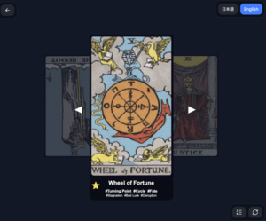

# Tetorica Tarot

A lightweight tarot-based idea generator for creators.

https://kyorohiro.github.io/tetorica-tarot/



## ✨ What is this?

Tetorica Tarot is a simple tool that draws a tarot card and shows its core meanings.

It is designed not as a fortune-telling app, but as a **creative support tool**.

Use it to spark ideas for:

- Stories
- Characters
- Worldbuilding
- Game concepts

## 🎴 Features

- Draw a random Major Arcana card
- Upright / Reversed meaning
- Minimal keyword-based interpretation
- Smooth card flip animation
- Works on PC and Web (PWA)

## 🧠 How to use

1. Tap the card to flip
2. Flip again to draw a new card
3. Read the keywords
4. Use them as inspiration

That's it.

## 💡 Concept

Instead of giving full generated stories, this tool provides **small triggers**.

You build the story.

## 📱 Platforms

- Web (itch.io / browser)
- Desktop (Tauri)

## 🛠 Tech

- Tauri
- React + Vite
- PixiJS

## 📦 License

Card images are based on public domain tarot decks (Rider–Waite–Smith).

This project may include CC-licensed assets.

## ⚠️ Notes

This is not a fortune-telling tool.

It is a **creative thinking tool**.

## 🚀 Future Plans

- 3-card spread (story mode)
- Multiple card layouts
- Optional story hints


# REFERENCE

## Tarot Card Image

- https://luciellaes.itch.io/rider-waite-smith-tarot-cards-cc0


# How to Build / Deploy 


``` 
% sh deploy_mac.sh
% ~/bin/butler login
% ~/bin/butler push src-tauri/target/release/bundle/dmg/tetorica-tarot_0.3.2_aarch64.dmg kyorohiro/tetorica-tarot:mac-apple-silicon --userversion 0.3.2

% ~/bin/butler push src-tauri/target/x86_64-apple-darwin/release/bundle/dmg/tetorica-tarot_0.3.2_x64.dmg kyorohiro/tetorica-tarot:mac-intel --userversion 0.3.2

% ~/bin/butler push "tetorica-tarot_0.3.2_x64-setup.exe" kyorohiro/tetorica-tarot:windows --userversion 0.3.2
```


### For itch.io / web pag

```
npm run build:web
cd dist
zip -r ../web-build_0.3.2.zip .
```

### For github pages (pwa)

```
npm run build:gh
cd dist
zip -r ../web-build_0.3.2_gh.zip .
```